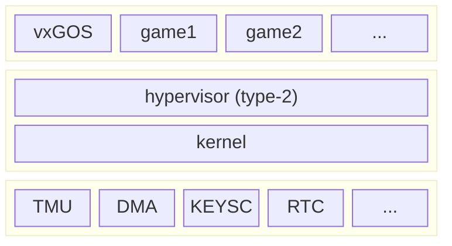

> [!CAUTION]
> This project is only experimental for now and I do not plan to fully
> commit into it since this is just a long-term background task to me.
> Moreover, there is (at the time I writing this) nothing to show or tests
> for now (the kernel build, start, display some debug information and wait
> for a manual reset)
>
> Also note that I am currently rewriting a lot of the code base to unify
> and clean critical parts. So, a lot of the code (mainly in kernel source)
> is not currently used.

VxGOS is an operating system designed to provide a "sandbox" for prototyping
high-level projects like games or extremely low-level projects like drivers
and kernels. This can be achieved by the fact that the operating system
provides an exotic hypervisor and interfaces that allow you to execute
privileged instructions, perform "hypercalls" (requests to the kernel to
perform temporary jobs), draw sprites, handle inputs, ... and more. Also note
that this particular kernel is "mono-process" which means that we really are
alone with the hardware during the execution of your homebrew !



Above is a representation of the operating system's architecture. Extremely
simple, as we don't care about security. The kernel only provides drivers,
the hypervisor, and game primitives (including drawing, input handling,
etc.) do whatever you want with it!

<div align="center">

[roadmap](https://github.com/YannMagnin/vxGOS/issues/30)
| [releases](https://github.com/YannMagnin/vxGOS/releases)

</div>

## Supported devices

For now, mainly Casio calculators are supported. Mainly because I have some
years of reverse engineering experience on these devices, and because I can
quickly test the project on real hardware.

<div align="center">

|   Name    | Description                   | Status |
| :-------: | ----------------------------- | ------ |
| `fxcg50`  | Casio color calculator        | 🟢     |
| `fx9860`  | Casio monochrom calculator    | 🟢     |
| `fxcp400` | Casio touch-screen calculator | 🟢     |
| `raspi3b` | RaspberryPi 3b                | 🔴     |

</div>

Some tests have been performed on the `RaspBerryPi 3b` device, but since
this device is badly documented and relies on proprietary firmware in its
GPU, I probably will never support this device (maybe committing to
`BananaPi`, which is a clone using a documented `ARMv7` processor). However,
these experiences have confirmed that the kernel can support other
architectures than the 32-bit, outdated SuperH family.

Also note that the `fxcp400` uses my own custom firmware that allows me to
load my kernel in memory. This custom firmware will not be released for
legal reasons, but I am currently working on an exploit that will allow
to run it without modifying the original firmware (not a promise here).

## How to build

A lot of magic will be involved in building the project (e.g., all
`CMakefiles` will be generated on-the-fly). So, you'll need to install the
SDK, which is written in Python and requires
[Poetry](https://github.com/python-poetry/poetry) (and Python `3.10`).

```bash
# create a virtual environment
# note that this step can be skipped if you know how to handle virtual
# environment in python
poetry shell

# install the SDK
poetry install

# check that the SDK is installed
vxsdk --help
```

Now that the SDK is installed, you can select and build the kernel to the
device you want to:

```bash
# list all available boards
# @note
# the output can look like this:
#   S- fxcg50
#   -C fx9860
#   -- fxcp400
# the two dashes that can be "S" for Selected and "C" Configured
vxsdk board list

# initialise the device
# @note
# > If you perform the previous step, you will notify that the "S" has been
#   moved to the "fxcg50" board line, which indicate that the board is
#   selected
vxsdk board select fxcg50

# build the kernel (it will build the current selected board)
# @note
# > Some external binaries are needed, like `CMake`. If an error is
#   displayed, you can manually install the missing binary.
# > You may encounter an error during the building step, which is probably
#   due to the missing toolchain binary. For example, the boards `fxcp400`,
#   `fxcg50`, and `fx9860` require a special `sh-elf-vhex-gcc` toolchain
#   that can be found at https://github.com/YannMagnin/sh-elf-vhex.
vxsdk build
```

Some other commands exist, but mainly for debugging reasons (such as
displaying asset information and analyzing asset conversions, etc.), but I
will not cover these parts here.

## Special thanks

A big thanks to [Lephenixnoir](https://silent-tower.net/research/) who
helped me a lot and allowing me to use its `kmalloc` implementation !
